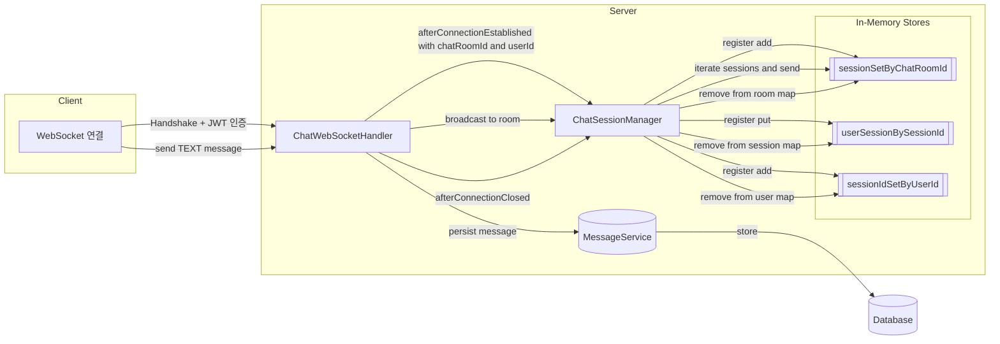
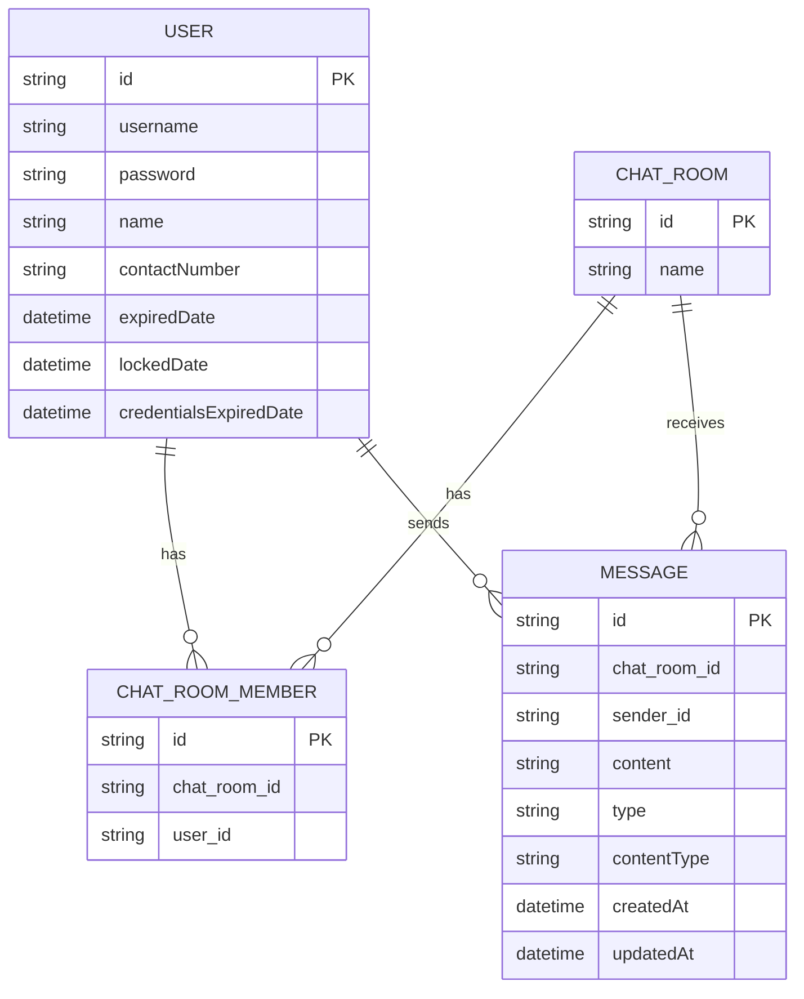

# Chat Demo Application

## 채팅 세션 저장 방식 (Mermaid 다이어그램)
다음은 현재 WebSocket 기반 채팅 핸들러가 세션을 메모리에 관리하는 구조를 요약한 다이어그램입니다. 코드 세부 구현은 생략하고, 데이터 흐름과 컬렉션 간 관계만 시각화합니다.

- 인증: JwtHandshakeInterceptor를 통해 WebSocket Handshake 시 Authentication이 세션 attributes에 저장됩니다.
- 세션 키 구조:
  - sessionSetByChatRoomId: 채팅방별 활성 WebSocketSession 집합
  - userSessionBySessionId: 세션ID로 UserSession(userId, chatRoomId) 역참조
  - sessionIdSetByUserId: 사용자별 다중 세션 지원을 위한 세션ID 집합
- 브로드캐스트: 동일 chatRoomId에 매핑된 세션들에만 메시지를 전송합니다.

## 엔터티 ERD (Mermaid ER Diagram)
메시지와 채팅방, 사용자 간의 관계를 간략히 표현합니다.

참고 사항
- User-Role은 다대다(tb_user_role)가 있으나 채팅 흐름 핵심과 직접 관련이 없어 도식에서 생략했습니다.
- Message.type은 TEXT/NOTIFICATION 등 Enum이며, contentType은 text/plain, application/json 등으로 확장 가능합니다.
- 실제 컬럼/제약의 전체 목록은 소스 코드를 참고하세요.

### 왜 세 가지 인덱스가 모두 필요한가
현재 ChatSessionManager는 세 가지 관점으로 WebSocket 연결을 인덱싱합니다.
- 방 중심: sessionSetByChatRoomId (chatRoomId -> Set<WebSocketSession>)
- 세션 중심: userSessionBySessionId (sessionId -> UserSession{sessionId, userId, chatRoomId})
- 사용자 중심: sessionIdSetByUserId (userId -> Set<sessionId>)

이 세 가지는 서로 중복처럼 보이지만, 각기 다른 질의와 작업을 “직접 조회(O(1))”로 해결하게 해 주는 필수 인덱스입니다. 아래에서 하나씩 용도, 없는 경우의 문제, 성능/일관성 관점을 설명합니다.

---

### 1) sessionSetByChatRoomId: 채팅방별 세션 집합이 필요한 이유
타입: Map<String, Set<WebSocketSession>>

- 핵심 용도
    - 방 브로드캐스트를 즉시 수행: 특정 chatRoomId에 속한 세션들만 빠르게 찾아 메시지를 전송합니다. 현재 broadcastToRoom이 바로 이 구조에 의존합니다.
    - 방의 현재 참가자 수 조회, 방 비우기/정리: 참가자 수 로그, 방에 남은 세션이 없을 때 맵 엔트리 제거 같은 관리 작업에 필요합니다.

- 이게 없으면 어떻게 되나
    - 매 브로드캐스트마다 전체 접속 세션을 스캔하며 “이 세션의 방이 맞나?”를 확인해야 합니다. 이는 O(전체 세션 수)로 커지고, 사용자 수가 늘수록 비용이 커져 실시간성이 떨어집니다.
    - 방 정리 로직(빈 방 제거)도 비효율 또는 난해해집니다.

- 성능/일관성 포인트
    - ConcurrentHashMap + newKeySet을 써서 동시성 충돌을 줄입니다.
    - remove 시 빈 Set이면 방 키를 제거해 메모리와 조회 비용을 줄입니다.

---

### 2) userSessionBySessionId: 세션ID로 사용자/방을 역참조가 필요한 이유
타입: Map<String, UserSession>

- 핵심 용도
    - 연결 종료 처리의 기준점: afterConnectionClosed나 에러로 세션이 끊길 때, 우리가 갖고 있는 건 보통 WebSocketSession(=sessionId)뿐입니다. 이 때 userId와 chatRoomId를 즉시 알아내어 올바른 정리 절차(방에서 제거, 사용자 인덱스에서 제거, 퇴장 알림 브로드캐스트)를 수행해야 합니다.
    - 에러 발생 시 정리: broadcastToRoom 중 전송 실패/세션 종료가 감지되면 removeSession(session)을 호출하는데, 이때도 sessionId -> userId/chatRoomId 역참조가 있어야 정확히 어디서 제거할지 알 수 있습니다.
    - 감사/로깅과 정책: 누가 어떤 방에서 어떤 세션으로 연결됐는지 단일 키(sessionId)로 신속히 확인할 수 있습니다. 동일 사용자의 다중 접속이 있어도 모호하지 않습니다.

- 이게 없으면 어떻게 되나
    - 세션만 가지고 userId, chatRoomId를 알아내려면 다른 인덱스들을 역으로 전수 조사해야 합니다(예: 모든 방의 세션 Set을 훑거나, 모든 사용자 세션 집합을 훑음). 연결 종료는 자주 일어나는 이벤트이므로 O(N) 스캔은 병목이 됩니다.

- 성능/일관성 포인트
    - 세션을 “사실의 원천(Single Source of Truth)”로 두고, 나머지 두 인덱스는 유도된 인덱스처럼 관리됩니다. 제거/정리의 출발점이 명확해 일관성을 유지하기 쉽습니다.

---

### 3) sessionIdSetByUserId: 사용자별 세션 집합이 필요한 이유
타입: Map<String, Set<String>>

- 핵심 용도
    - 다중 접속(멀티 디바이스/멀티 탭) 지원: 한 사용자에게 연결된 모든 세션을 한 번에 파악하거나 제어할 수 있습니다.
    - 사용자 단위 조작: 강제 로그아웃(해당 userId의 모든 세션 종료), 사용자 온라인 여부/세션 수 조회, 사용자별 연결 제한(예: 동시 접속 n개 제한) 같은 정책을 즉시 적용 가능합니다.
    - 사용자 타겟 푸시: 특정 사용자에게만 메시지를 보내야 할 때, 해당 사용자의 모든 세션ID를 가져와 세션 객체로 매핑해 전송할 수 있는 기반을 제공합니다.

- 이게 없으면 어떻게 되나
    - “이 사용자에게 열린 모든 세션”을 얻으려면 방-세션 맵을 전부 뒤져야 합니다. 사용자 중심의 운영 기능(강제 로그아웃, 단일 기기 정책 등)이 사실상 구현 난이도가 급격히 올라가거나 비효율적입니다.

- 성능/일관성 포인트
    - 사용자별 Set이 비면 아예 userId 키를 제거해 메모리와 스캔 비용을 줄입니다.

---

### 세 인덱스의 조합이 만드는 이점
- 각 관점의 대표적 쿼리를 O(1)로 해결
    - 방 → 세션들: sessionSetByChatRoomId.get(roomId)
    - 세션 → 사용자/방: userSessionBySessionId.get(sessionId)
    - 사용자 → 세션들: sessionIdSetByUserId.get(userId)
- 고빈도 경로에서 스캔 제거로 지연과 부하 감소: 브로드캐스트, 연결 종료, 사용자 강제 종료가 모두 직접 조회로 처리됩니다.
- 일관된 정리 경로: 제거는 sessionId를 기준으로 시작해(세션 중심), 방/사용자 인덱스를 함께 갱신하여 누수를 줄입니다. 코드에서도 broadcast 중 닫힌 세션을 모아 removeSession에 위임하는 패턴으로 세 인덱스가 함께 정리됩니다.

---

### 없을 때 생기는 구체적 병목/취약점 요약
- sessionSetByChatRoomId가 없으면: 방 브로드캐스트마다 전수 스캔 → 지연/CPU 급증, 빈 방 정리 어려움.
- userSessionBySessionId가 없으면: 세션 종료시 userId/chatRoomId 파악을 위해 전수 스캔 필요 → 종료 처리 지연, 정리 누락 위험.
- sessionIdSetByUserId가 없으면: 사용자 단위 제어(강제 로그아웃, 동시 접속 제한, 온라인 상태 파악)가 비효율/복잡 → 운영/보안 정책 구현 난이도 상승.

---

### 운영/확장 관점의 참고사항
- 원자성: 세 인덱스는 서로 다른 ConcurrentHashMap에 분산되어 있어 완전한 트랜잭션은 아닙니다. 실시간 WS에서 약간의 최종일관성은 허용되지만, 더 강한 일관성이 필요하면 사용자/방별 락(예: ReentrantLock per key)이나 단일 레지스트리 객체에 대한 동기화, 혹은 이벤트 로그 기반 정합성 복구를 고려할 수 있습니다.
- 대규모 확장: 인메모리 맵은 단일 인스턴스에 한정됩니다. 서버를 수평 확장하려면 Redis 같은 외부 저장소로 인덱스를 이전하고, Redis Pub/Sub 또는 메시지 브로커(STOMP/SimpMessagingTemplate, Kafka 등)로 방 브로드캐스트를 분산 처리하는 방식을 고려하세요.
- 메모리 관리: 빈 방/사용자 키 제거가 구현되어 있어 누수 가능성을 낮춥니다. 주기적 스캔으로 닫힌 세션 정리(heartbeat 기반)나 TTL을 추가하면 더 견고해집니다.

---

### 한눈에 보는 매핑과 대표 시나리오
- 입장(addSession)
    - roomId → Set<WebSocketSession>에 세션 추가
    - sessionId → UserSession 저장
    - userId → Set<sessionId>에 sessionId 추가
- 브로드캐스트(broadcastToRoom)
    - roomId로 세션 Set을 즉시 조회해 반복 전송, 실패/닫힌 세션은 removeSession으로 위임
- 퇴장(removeSession)
    - sessionId로 UserSession 조회 → roomId/userId 파악
    - roomId Set에서 세션 제거, Set이 비면 roomId 키 삭제
    - userId Set에서 sessionId 제거, Set이 비면 userId 키 삭제

이처럼 세 가지 인덱스는 “방 중심 송신”, “세션 중심 정리”, “사용자 중심 운영”이라는 서로 다른 고빈도 요구를 모두 상수 시간으로 처리하기 위해 동시에 존재합니다.