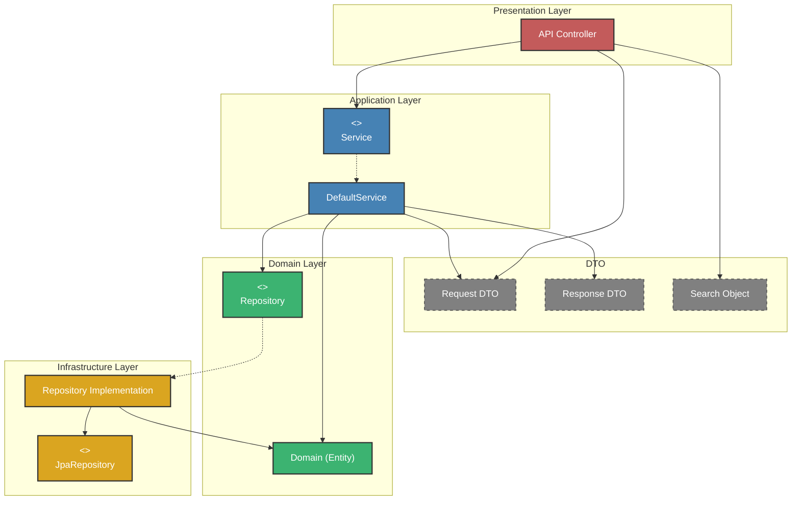

# 레이어드 아키텍처 (Layered Architecture)

chat-demo 프로젝트는 관심사의 분리와 유지보수성 향상을 위해 표준 레이어드 아키텍처를 따릅니다.

## 아키텍처 다이어그램

## 레이어별 역할

### 1. Presentation Layer (컨트롤러)
- **구성 요소**: `*ApiController`
- **역할**:
    - HTTP 요청 수신 및 응답 반환
    - 사용자 권한 검증 (`@PreAuthorize`)
    - 입력 데이터 검증 (`@Valid`)
    - 서비스 메서드 호출 및 결과 반환

### 2. Application Layer (서비스)
- **구성 요소**: `*Service` (인터페이스), `Default*Service` (구현체)
- **역할**:
    - 비즈니스 로직 수행 및 트랜잭션 관리
    - **입력**: `Command` 또는 `Search` 객체 사용
    - **출력**: `Model` 객체 반환 (엔티티 직접 노출 금지)
    - 엔티티와 모델 간의 변환 작업

### 3. Domain Layer (도메인)
- **구성 요소**: `Entity`, `Repository` (인터페이스)
- **역할**:
    - 비즈니스 핵심 규칙 및 상태 관리
    - 데이터 액세스를 위한 추상화 인터페이스 제공
    - 모든 엔티티는 `BaseEntity`를 상속받음

### 4. Infrastructure Layer (인프라)
- **구성 요소**: `JpaRepository`, `RepositoryImpl`
- **역할**:
    - 실제 데이터베이스 액세스 구현
    - 외부 시스템 연동 (파일 시스템, 메일 서버 등)

## 주요 원칙

- **불변 모델**: `Model` 객체는 `final` 클래스이며 불변성을 유지해야 합니다.
- **명확한 입력/출력**: 서비스 레이어의 입력은 `Command`, 출력은 `Model`을 사용하는 것을 원칙으로 합니다.
- **의존성 방향**: 상위 레이어에서 하위 레이어로의 단방향 의존성을 유지합니다.
- **지연 로딩**: JPA 연관 관계는 항상 `LAZY` 로딩을 사용합니다.
